# Introduction

The project is a Hybrid GI solution, partly inspired by Lumen and DDGI. The main core idea is to provide a complete GI solution (including Indirect-Light, Infinite-Bounce, Emissive-Lighting, Glossy-Reflection, Shadow, AO) that can run on both Raytracing-supported and non-raytracing hardware. Due to the shortage of time, there are still some performance issues in this project, but as a throwaway, I believe it can provide some new ideas to most of the people who are interested in GI.

Before we start, let's talk about DDGI (Dynamic-Diffuse-Global-Illumination)

## DDGI

Among the original implementations of DDGI ( [description](https://morgan3d.github.io/articles/2019-04-01-ddgi/), [paper](https://jcgt.org/published/0008/02/01/)), DDGI is a real-time based probe and ray-tracing technique that mainly addresses the global light diffuse reflection term of dynamic scenes and light sources.

The traditional light probe is aim to collect light information from the perspective of the probe, and when a point on the screen is to going to be shaded, getting all probes that are close to the shading point, and then interpolation is performed. Therefore, the discrete information obtained by each probe can be reduced to continuous light information through interpolation, but once there is a sudden change in the signal, there can be light leakage problems.

However, the DDGI can avoid light leakage by saving the geometric information of the scene and then by probability.

### 1.DDGI Probe

DDGI Probe uses an Octahedral Map method to store spherical information. The Octahedral Map is a good way to be compressed it into a Texture2D.
. (For those familiar with lumen, lumen also uses this way of expressing probes)

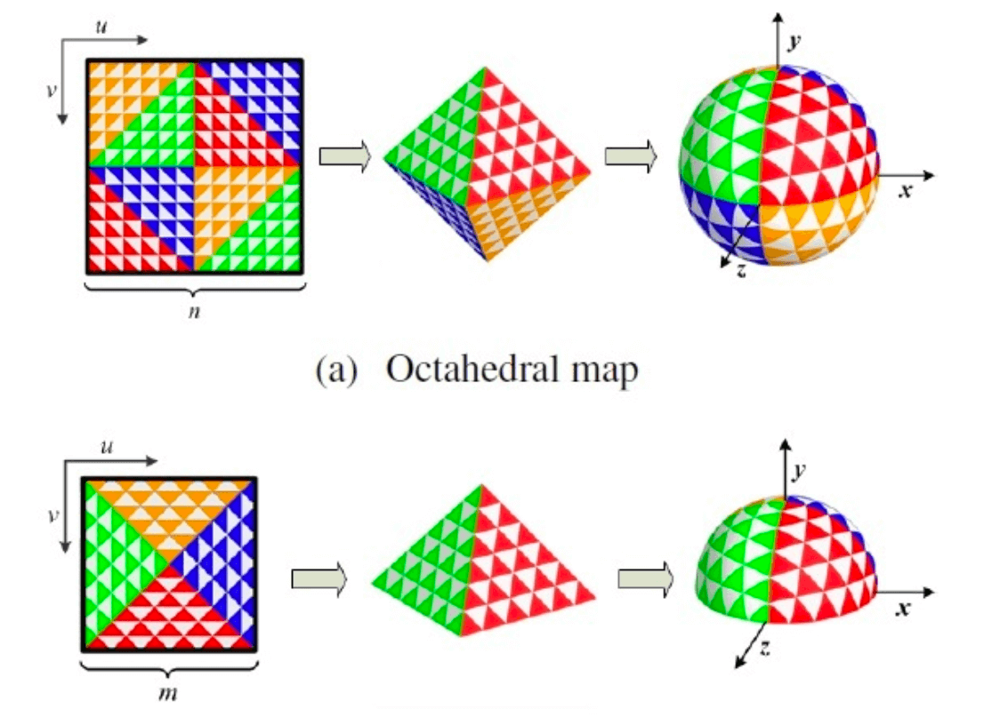


### 2.DDGI Flow

Step1. For each Probe generate 100-300 rays, and trace, to get the current ray's hit the color and distance information. Therefore, it is necessary to create Texture2D to record the current information.

```c++
    //Radiance for every ray.
    internal.radiance->setName("DDGI Raytrace Radiance");
    internal.radiance->buildTexture(TextureFormat::R11G11B10F, pipeline.raysPerProbe, totalProbes);

    //Direction and Depth for every ray.
    internal.directionDepth->setName("DDGI Raytrace Direction Depth");
    internal.directionDepth->buildTexture(TextureFormat::RGBA16, pipeline.raysPerProbe, totalProbes);
```

Since the diffuse GI of the point where the light hits is provided by the Probe of the previous frame, infinite bounce can be achieved in this way.

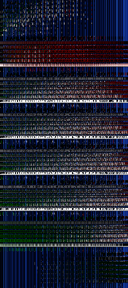

The vertical axis is the ProbeId and the horizontal axis is the Radiance obtained for each ray.

Step2. Once the Radiance and Depth are obtained, the probe can be updated, i.e., the Radiance map is used to update the Irradiance of the Probe (while updating the distance information).

```c++
    for(int32_t i = 0;i<2;i++)
    {
        internal.depth[i]->setName("DDGI Depth Probe Grid " + std::to_string(i));
        internal.depth[i]->buildTexture(TextureFormat::RG16F, depthWidth, depthHeight);    //Depth and Depth^2

        internal.irradiance[i]->setName("DDGI Irradiance Probe Grid " + std::to_string(i));
        internal.irradiance[i]->buildTexture(TextureFormat::RGBA16, irradianceWidth, irradianceHeight);
    }
```

Step3. Border update

Because DDGI uses bilinear interpolation, special operations are required for the borders.

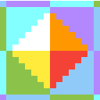

Step4. Each pixel should be sampled by using 8 probes in its neighborhood.
One important is that when sampling with probes, we need to perform a visibility test to prevent light leakage problems.

- Visibility testing.
Since there is the problem of a wall between the probe and the sampling point, we need to perform visibility tests to avoid light leakage.

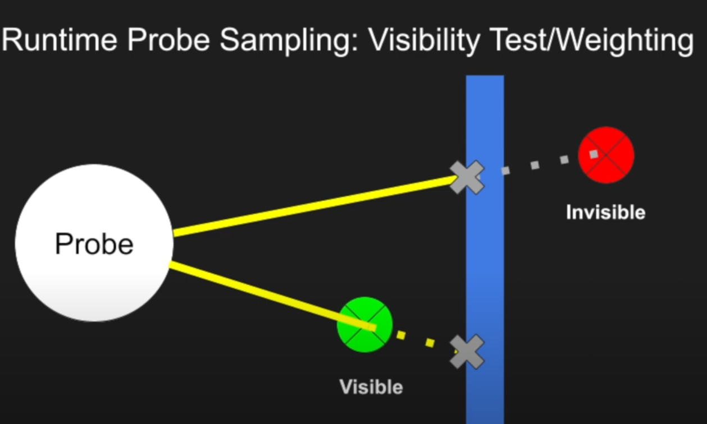


In the above, we know that the distance information $d$ and the square of the distance $d^2$ is stored for each ray tracing, so we can use $d$ and $d^2$ for visibility tests

Here we introduce the Chebyshev inequality.

$P(r > d) \leq \frac{Var}{Var + (d - mean) ^ 2}$

where $r$ is the distance that probe sees the nearest object in the direction of the shading point, $d$ is the distance between the shading point and probe, and $P(r > d)$ represents the probability of no occlusion.

When $d > mean$, we use Chebyshev weights, otherwise we use 1 directly

### Infinity Bounce

The data from the previous probe frame is repeatedly used to perform an indirect illumination of the current scene, which is calculated to achieve an infinite bounces.

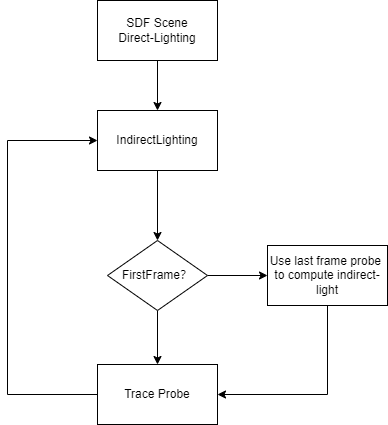

## SDF Acceleration Structure

SDF can be said to be the standard for the next generation engine, which not only provides ray tracing-like algorithms, but also supports SDF soft shadows, SDFAO and GPU-Particle collision detection.

During the Trace phase of DDGI's Probe, we need to record the distance by each ray as well as the color information. The algorithm can be well implemented on hardware that supports ray tracing, but since most machines do not support hardware ray tracing, we need to use other ways to
get the color information.

First of all, SDF is a very good acceleration structure that can replace hardware ray tracing in some cases, so in current project, for machines that do not support hardware raytracing, we use SDF for replacement.

## SDF Flow：

### Generate MeshDistanceField

For each object in the scene generate its corresponding SDF, i.e. create Texture3D (R16F) with 32-128 (on-demand) resolutions to store distance information. And generate mipmap at the same time.

Since the SDF generation process uses ray tracing method, we can use Uniform Grid , KD-Tree , BVH-Tree to accelerate the construction. In this project, BHV-Tree is used for accelerated intersection.

A padding operation is also performed for each object to prevent the problem of leaks caused by objects that are too thin.

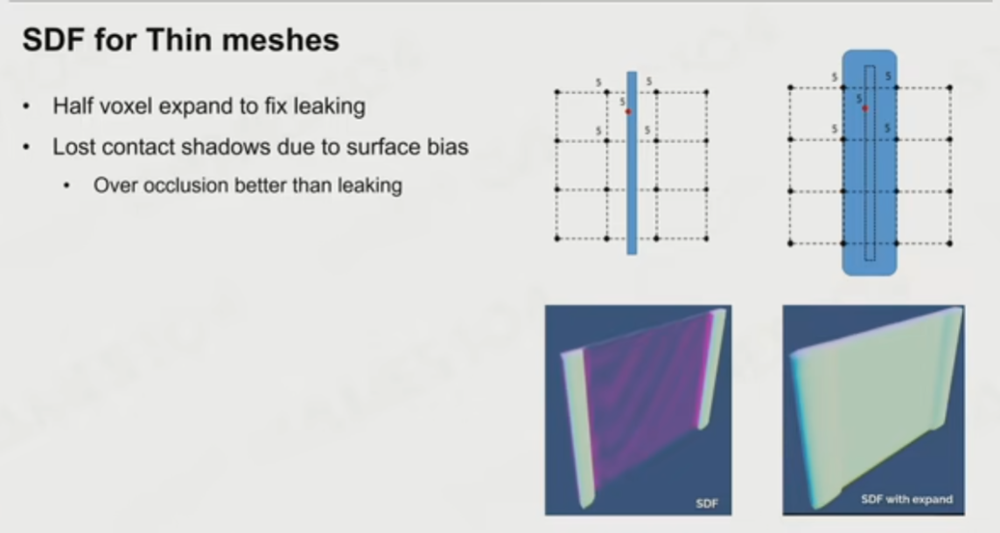

- Step2. Create GlobalDistanceField

After having the above MeshDistanceField, GlobalDistanceField is created and its corresponding Mimmap is generated, since the current algorithm does not use the Lumen-like Detail-Trace (it may be implemented in a future version, but GlobalSDF can work better with DDGI-Cascade). Global is created to accelerate the SDF-Trace. 

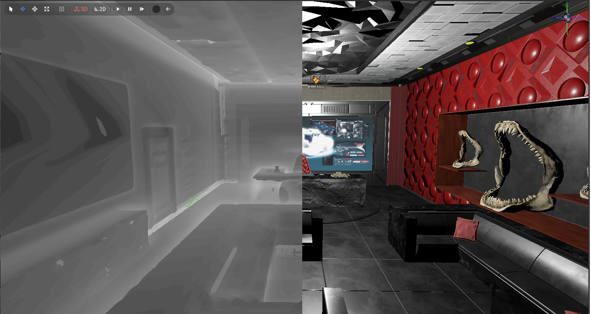

### The generation algorithm of GlobalDistanceField

```c++

float minDistance = DistanceMax;

minDistance *= imageLoad(uGlobalSDF,voxelCoord).r;

for (uint i = 0; i < pushConsts.objectsCount; i++)
{
    uint objId = pushConsts.objects[i];
    MeshDistanceField meshDF = data[objId];
    minDistance = min(minDistance, distanceToMeshSDF(minDistance, meshDF, uMeshSDF[objId], voxelWorldPos));
}
```

In the game, we need to satisfy the real time, so we need to update the GlobalSDF when some elements in the scene are changed. Therefore, for dividing the space, i.e., updating the grid where dynamic objects are moved, in current algorithm we use the Uniform Grid (Chunk).

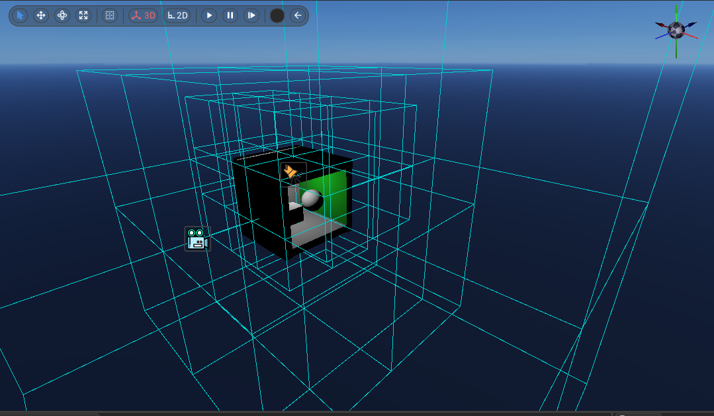

A attention point is that the generation of Mimmap needs to be calculated manually, we can not calculate the mipmap value by average the original one, we have to choose the minmum value. the way looks like Hi-Z.

### SDF Surface Material

Once we have the SDF acceleration structure, we can use the SDF for tracing, but the SDF is essentially a function describing the distance without any color or material information, so we need to build additional data types to generate the color and material information of the corresponding points of the SDF.

The implementation of Lumen[Surface Cache](https://docs.unrealengine.com/5.0/en-US/lumen-technical-details-in-unreal-engine/) is a very efficient way to obtain SDF materials, and the same approach is also used in the current algorithm for SDF material representation

#### Surface-GBuffer

Each object in the scene is captured on 6 sides and rendered to a different SurfaceAtlas. This process is the same as the traditional GBuffer process.
In the current algorithm, we generate Color/Normal/Depth/PBR/Emissive/LightCache Atlas and TileBuffer for each face.

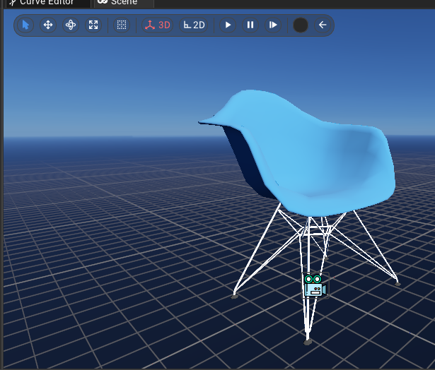

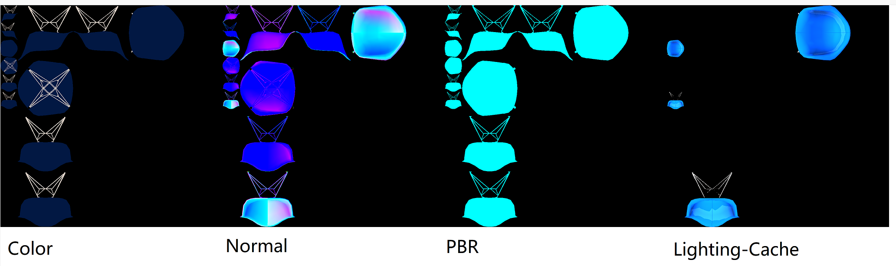

#### Culling

In order to improve the overall rendering efficiency and avoid overdraw, we need to cull the objects in the scene (including the Tile associated with each object) in this stage.

#### Light Culling

The lighting just light objects within its range for point and spot lights, and all potentially affected objects (as needed) for parallel light intensities.

#### Object Culling

The objects outside the camera Far-Plane are culled, and the objects whose volume is smaller than the size threshold are ignored. Since the world space is divided into different Chunks, in order to ensure the performance of SDF after intersection, a culling operation is performed here, i.e., each Chunk keeps the objects that intersect with the current Chunk and sets a maximum limit on the number of objects.

#### Obtain Material

Obtaining the material for a point in the SDF space can be done as follows.

1. Get the world coordinates after intersection, and project the current world coordinates to the corresponding ChunkId.

2. Iterate through all the Tile in the current Chunk, and judge the direction of the normal to the hit point and the orientation of the surface, if the current ray is almost parallel to the surface, then discard it. Otherwise, using normal to represent weight for its surface.

3. If not parallel to the current front, try to sample. Because there is a problem of accuracy after SDF intersection, we obtain 4 points around the current hit point for a bilinear interpolation to ensure the correctness of sampling when sampling.

### Lighting

#### Direct Lighting

Afterwards, the Tile data of all affected objects are updated (SDF scene representation does not require real-time, so it can be operated in latency-frames), and a direct lighting is performed using the current SDF-GBuffer and stored in SurfaceLightCache. Because SDF provides visibility queries, the SurfaceDirectLight stage can be directly query shadows using SDF, as shown in the following figure.

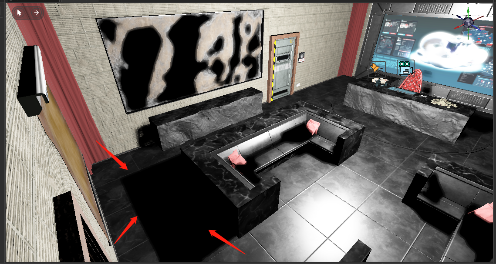
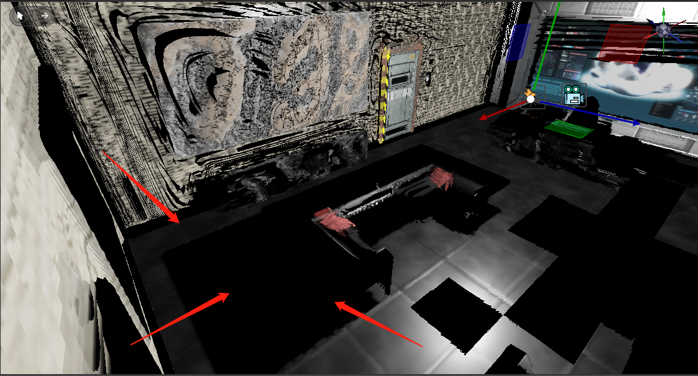

#### SDF Infinity Bounce

Infinite Bounce is the original function of DDGI. One point is that each indirect illumination result will be written back to SDFScene(LightCache) until convergence.

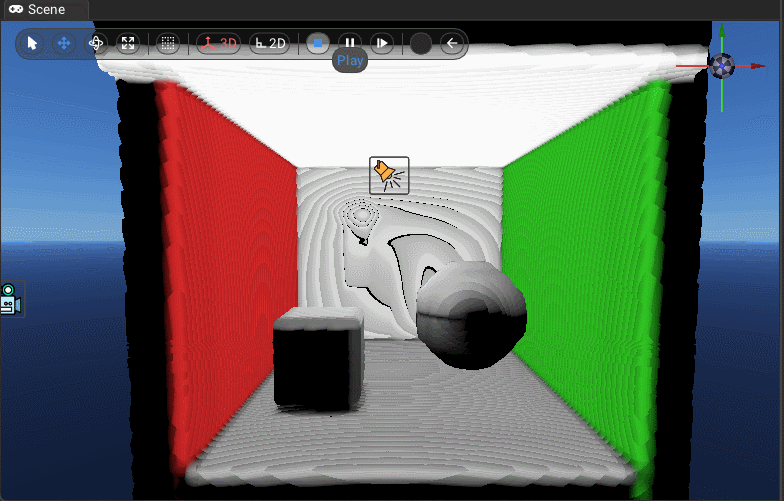

## Raytracing

In the case of hardware support, ray tracing can be enabled instead of SDF-Trace, and the other implementation algorithms do not differ much, so I won't go into too much detail in this section.

## Reflection

The reflection of the object surface is basically similar to the implementation of ray tracing and SDF-Trace, which mainly deals with Glossy Reflection and Specular Reflection
In the current algorithm implementation, when the surface roughness of the object is less than 0.05, we can think the surface as specular, which uses the specular illumination algorithm


When the material of the object surface is between 0.05 and 0.7, we consider the object material as Glossy at this time, because Glossy material produces reflected light in different directions. To ensure that the sampling is spatially homogeneous, we use [Blue noise and Sobol sequence](https://belcour.github.io/blog/slides/2019-sampling-bluenoise/index.html) to generate samples, while using importance sampling to ensure its fast convergence ([Reference](https://learnopengl.com/PBR/IBL/Specular-IBL))

When the material roughness is greater than 0.7, we directly sample the current surface using a probe.

Notable points are: SDF can not be specular reflection (because the scene for SDF expression), in order to make up for the shortcomings of specular reflection, you can add screen space reflection in the SDF reflection (not implemented) [Lumen](https://docs.unrealengine.com/5.0/en-US/lumen-global-illumination-and-reflections-in-unreal-engine/)

SDF Reflection
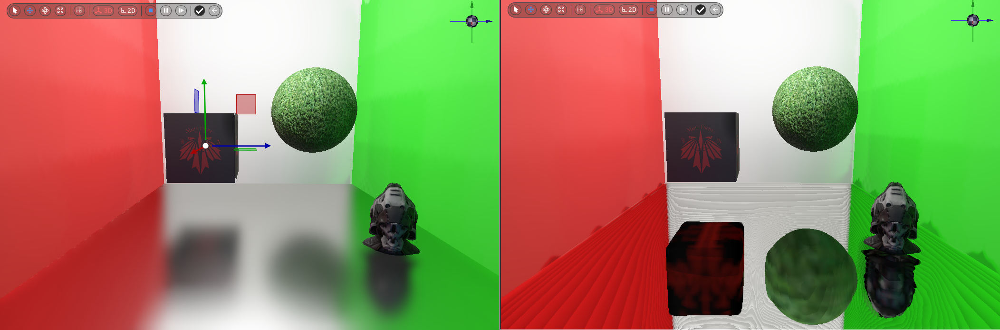
Raytracing Reflection
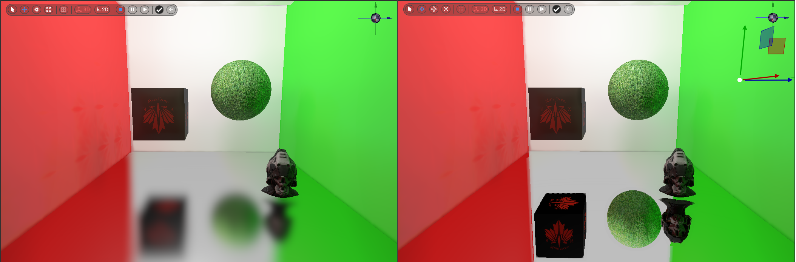

## Soft Shadow

SDF can support soft shadow effect, but due to the accuracy of GlobalSDF, it is currently not recommended to use GlobalSDF for visibility calculation.

But provide a implementation. [soft shading based on ray tracing method](https://blog.demofox.org/2020/05/16/using-blue-noise-for-raytraced-soft-shadows/) (higher cost)

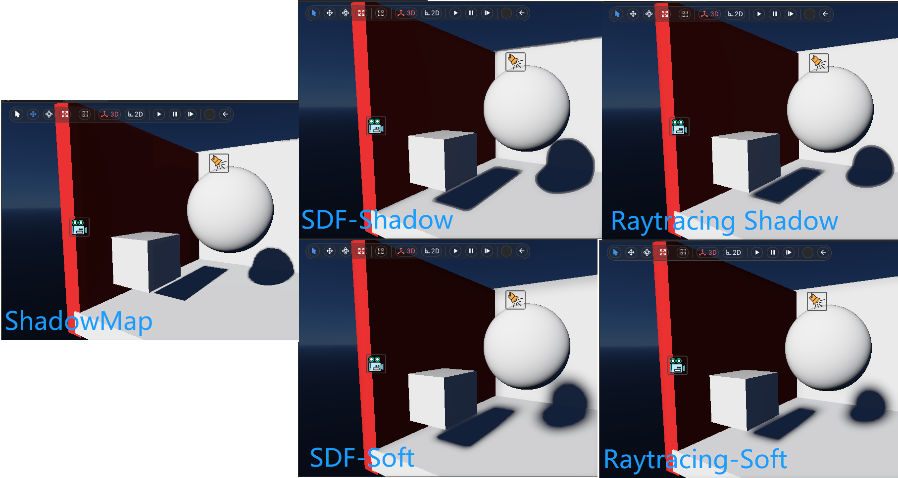

In the current algorithm, the number of samples for soft shadows 1, so there will be a lot of noise in the scene, in the project used the way of SVGF for denoising (the same reflection).

## Denoise

Current algorithms for real-time ray tracing are basically based on primary sampling + denoise. In this algorithm, the Denoiser is mainly applied to Glossy reflections and Soft shadows.

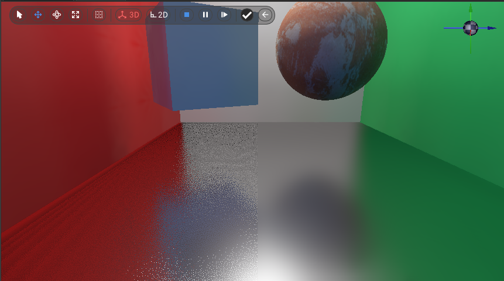

### Gaussian Filtering

Gaussian filter is a kind of low-pass filter (its core is to find the average value in the filter kernel), the result after the filter is finished is the low frequency information, so the filtered result will appear the whole screen blurred. But for the game, low-pass filtering is not perfect. [Reference](http://rastergrid.com/blog/2010/09/efficient-gaussian-blur-with-linear-sampling/)

### Bilateral Filtering

Since Gaussian filtering is a low-pass filter, it does not maintain the boundaries well for images with large signal variations. Therefore, we can use bilateral filtering to process the image. In bilateral filtering, an important reference value is the change in brightness of the current pixel as a weight, i.e., a large change in brightness has a small weight. [Reference](https://en.wikipedia.org/wiki/Bilateral_filter)


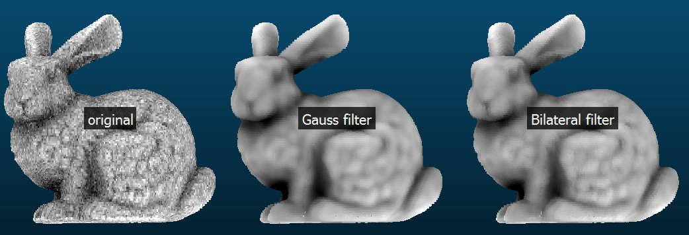

### Joint Bilateral Filtering

In Gaussian filtering, we consider the distance between pixels as the contributing weight, and in bilateral filtering, we consider the brightness of the pixels. In real-time rendering we can use GBuffer to guide the filtering, and if more factors are considered (e.g. depth, normal features, etc.) we call it joint bilateral filtering.

### SVGF

Spatiotemporal Variance-Guided Filtering
[NVIDA-Link](https://research.nvidia.com/publication/2017-07_spatiotemporal-variance-guided-filtering-real-time-reconstruction-path-traced) 

Among the current GI algorithms we chose SVGF for denoise, which is a denoise algorithm running on Spatial and Temporal, using joint bilateral filtering with the addition of variance analysis and some other features.

In SVGF we use an [Atrous](https://jo.dreggn.org/home/2010_atrous.pdf) for the filtering operation.

#### Spatial Filtering

In the spatial filtering part, SVGF uses the À-Trous wavelet filter, and also uses the progressive increase of Filter size to reduce the computational resource overhead, as shown in Fig.

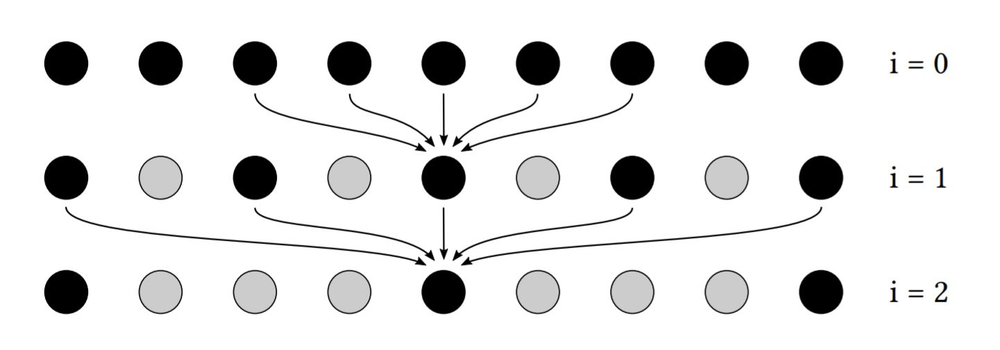

```c++
for (int yy = -RADIUS; yy <= RADIUS; yy++)
{
    for (int xx = -RADIUS; xx <= RADIUS; xx++)
    {
        const ivec2 coord = coord + ivec2(xx, yy) * STEP_SIZE; 
        // Edge stop....
    }
}
```

##### Depth factor

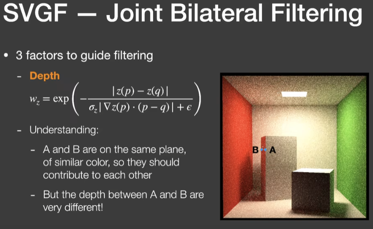

In Atrous, we first consider the depth factor, as in Figure A/B, because AB is on the same face, so in the process of filtering, AB should contribute to each other, but there is a difference in the depth of AB, so for the processing of depth, we will be more biased to use the gradient of depth for the operation.

##### Normal factor

Next we consider the effect of normals on denoise

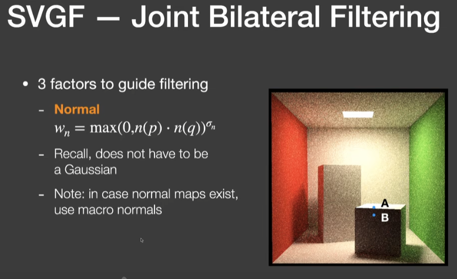

As shown in the figure, if the angle between the two points of AB is smaller, it means that the direction of the two points may exist all the way, so the value of $ W_n $ is more convergent with 1

##### Color factor

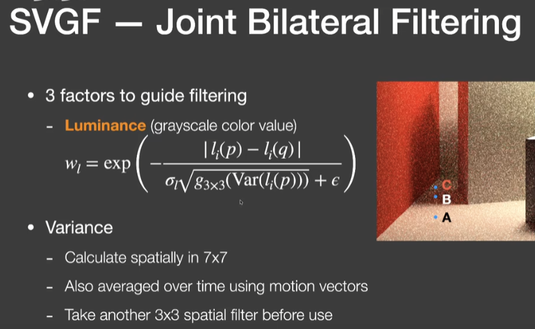

The contribution of color to the weight is mainly reflected in the change of color brightness, i.e. Luminance, but due to the existence of noise, the original noised color may be obtained, so we can correct this problem by variance.

#### Temporal Filtering

The filtering in time mainly reuses the information from the previous frame, in this case we can think of increasing the number of samples of the current pixel.

In order to obtain information about the previous frame's pixels in a reasonable way, we use the Motion Vector method to record the direction of the camera's movement, so that in the current frame, the specific pixels of the previous frame can be mapped back through the Motion Vector.

##### Normal factor

The main check is when the angle between two points is less than a specific threshold value, and the normal can be judged using the following formula

$Fn = |dot(n(a),n(b))| - T $(T is the threshold value)

If the current Fn is greater than 0, then the two points are not in the same plane and the current point is discarded.

##### MeshID

Because we can use the information of GBuffer in this stage, we can get the MeshID information of the corresponding point, and discard the point if the MeshIDs of two points of A/B do not match.
